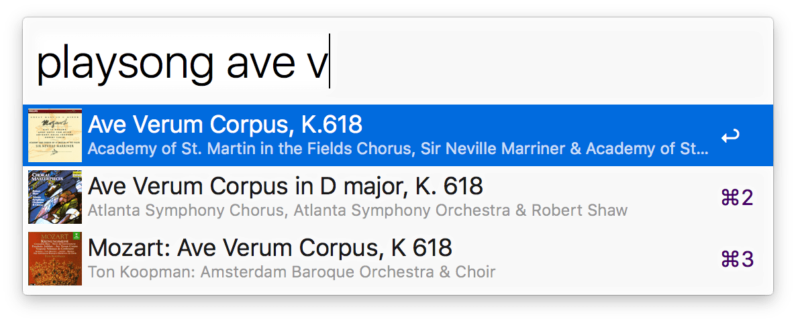

# Play Song

*Copyright 2013-2022 Caleb Evans*  
*Released under the MIT license*

Play Song is an [Alfred](http://www.alfredapp.com/) workflow designed to make
playing music in Music.app extremely quick and convenient.

The workflow will be solely supporting Alfred 5 going forward, but the workflow
versions last compatible with the previous versions of Alfred will remain
available here for your convenience.



Special thanks to [@Tyilo](https://github.com/Tyilo) for his invaluable feedback
and code contributions.

## Usage

Play Song includes a number of keyword filters which allow you to search for and
play songs in your Music.app library. For example:

### Playing a song

```
playsong hey jude
```

#### Playing a song in a particular album

```
playsongin abbey road
```

#### Playing a song by a particular artist

```
playsongby beatles
```

### Playing an album

```
playalbum pet sounds
```

#### Playing an album by a particular artist

```
playalbumby beach boys
```

### Playing an artist

```
playartist killers
```

### Playing a genre

```
playgenre alternative
```

### Playing a playlist

```
playplaylist favorites
```

### Controlling the Music app's global shuffle setting

```
shuffleon
```

```
shuffleoff
```

```
shuffletoggle
```

### Queueing songs

For any of the above filters, choosing a result with the `cmd` key held down
will queue the result (as opposed to playing it immediately). This allows you to
queue up multiple songs before playing them.

To play the songs you've queued, use the `playqueue` keyword. To clear the queue
of all songs, use the `clearqueue` keyword.

**Note:** At this time, Play Song does not support queueing for Apple Music
playlists.

## Searching songs on Google

For any of the above filters, choosing a result with the `ctrl` key held down
will search the result on Google.

### Clearing the cache

Play Song stores a local cache containing album artwork (from displayed
results), as well as the compiled workflow configuration. If you experience any
issues with Play Song, you can clear this cache via the `clearcache` keyword.

### A note about play order

Play Song always respects the current shuffle mode within Music.app. For example,
if shuffle is enabled, playing an album via Play Song will play the songs of the
album in shuffled order. Therefore, if you desire Play Song to respect album
order, run the `shuffleoff` command within Alfred.

Additionally, Play Song will honor the column you are sorting by in Music.app to
sort queued songs. This applies to keyword filters like `playartist`,
`playalbum`, and `playgenre`. For example, if you are sorting by "Album by
Artist" in your library, then Play Song will group artists together and group
albums together when using `playgenre`. However, if you are sorting by "Title"
in your library, then Play Song will disregard album groupings and simply play
songs in alphabetical order.

The `playplaylist` filter is the only Play Song filter where play order is
guaranteed.

### Playing a song directly (the Play Song v1 behavior)

If you are a longtime Play Song user who prefers the v1 behavior for playing
songs (where music continues playing after the song finishes), you can do so via
the `shift` modifier. Note that this only works for the `playsong` filter.

## Support

If you have a bug to report or a feature to request, please [submit an issue on
GitHub](https://github.com/caleb531/play-song/issues). You can also [contact me
directly](https://calebevans.me/contact/) via email.
